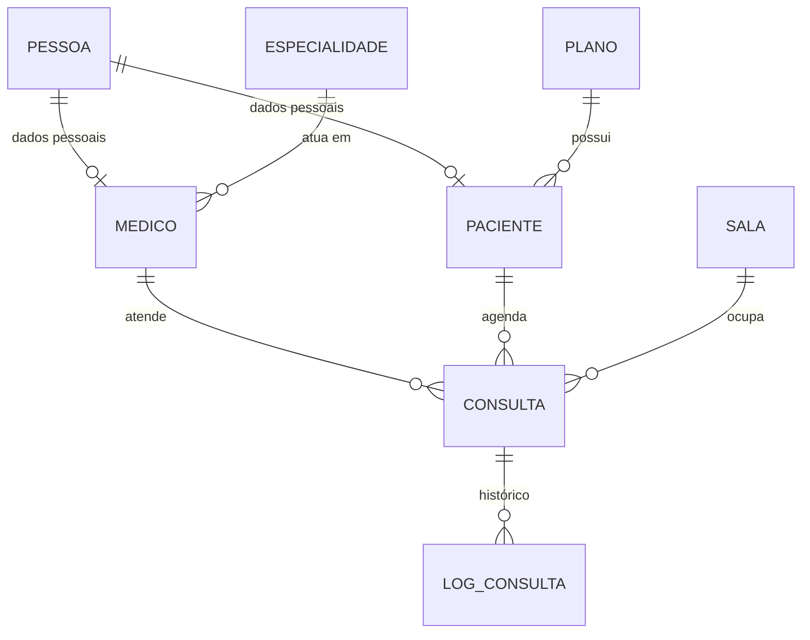

# Whister Agendamentos API

API REST para gestão de agendamentos de consultas em uma clínica: cadastro de médicos, pacientes, especialidades, planos e salas, com **cálculo automático de valor** (desconto de plano, desconto promocional e acréscimo por horário especial), **geração de horários disponíveis** e **histórico de status** de cada consulta.

Projeto desenvolvido para praticar arquitetura em camadas e regras de negócio reais com Spring Boot. O front-end está em [`whister_agendamentos_app`](../whister_agendamentos_app).

---

## Sumário

- [Stack](#stack)
- [Regras de negócio](#regras-de-negócio)
- [Modelo de dados](#modelo-de-dados)
- [Arquitetura](#arquitetura)
- [Como rodar](#como-rodar)
- [Endpoints](#endpoints)
- [Exemplo de uso](#exemplo-de-uso)
- [Decisões de projeto](#decisões-de-projeto)
- [Roadmap](#roadmap)

---

## Stack

| Camada | Tecnologia |
|---|---|
| Linguagem | Java 21 |
| Framework | Spring Boot 4 (Web MVC, Data JPA, Validation) |
| Banco | PostgreSQL |
| Mapeamento DTO ↔ entidade | MapStruct |
| Boilerplate | Lombok |
| Documentação | SpringDoc OpenAPI (Swagger UI) |
| Build | Maven (wrapper incluso) |

---

## Regras de negócio

### Agendamento de consulta

Ao criar uma consulta (`POST /api/consulta`) a API:

1. Valida se médico, paciente e sala existem.
2. Verifica se o horário está livre para a **especialidade** do médico. Se não estiver, responde `409 Conflict`.
3. Marca a consulta como **especial** quando o horário está fora do expediente (antes das 08:00 ou depois das 19:00).
4. Calcula o valor final (veja abaixo).
5. Salva a consulta com status `AGUARDANDO` e registra o primeiro log de status.

### Cálculo do valor

```
descontos   = valorBruto × (desconto do plano + desconto promocional da especialidade) / 100
valorFinal  = valorBruto − descontos
se especial: valorFinal = valorFinal + valorFinal × porcentagemEspecial / 100
```

Exemplo: consulta de R$ 200,00, plano com 10%, especialidade com 5% de promoção e horário especial com acréscimo de 20%:

```
descontos  = 200 × (10 + 5) / 100 = 30,00
valorFinal = 200 − 30             = 170,00
especial   = 170 + 170 × 20/100   = 204,00
```

Todo o cálculo usa `BigDecimal`.

### Grade de horários

Cada especialidade define a **duração** da consulta e o **intervalo** entre elas. A API monta a grade do dia a partir do início do expediente (08:00) até o fim (19:00) e remove os horários já ocupados.

`GET /api/consulta/horarios/{especialidadeId}` retorna os horários livres do dia para aquela especialidade.

### Ciclo de vida da consulta

```
AGUARDANDO ──► CONCLUIDA   (PUT /{id}/realizar)
     └───────► CANCELADA   (PUT /{id}/cancelar)
```

Cada mudança de status é registrada na tabela de log (`LogConsulta`) com status anterior, status novo e data/hora da alteração.

### Exclusão lógica

Médicos, pacientes, planos, salas e especialidades **não são apagados do banco**: o `DELETE` apenas marca `ativo = false` e o registro deixa de aparecer nas consultas. Isso preserva o histórico de consultas já realizadas.

---

## Modelo de dados



`Pessoa` concentra os dados em comum (nome, CPF, e-mail, telefone, nascimento) e é reaproveitada por `Medico` e `Paciente` em vez de duplicar campos.

---

## Arquitetura

Arquitetura em camadas, com cada pacote tendo uma responsabilidade:

```
src/main/java/br/com/whister/whisteragendamentosapi
├── controller/   # Endpoints REST, sem regra de negócio
├── service/      # Regras de negócio e orquestração
│   ├── ConsultaService       # fluxo de agendamento, cancelamento e realização
│   ├── HorarioService        # grade de horários e horário especial
│   └── LogConsultaService    # histórico de status
├── repository/   # Spring Data JPA
├── entity/       # Entidades JPA e enums
├── dto/          # Records de request/response, separados por recurso
├── mapper/       # Interfaces MapStruct
└── exception/    # Exceções customizadas e handler global (@RestControllerAdvice)
```

Fluxo de uma requisição:

```
Controller → Service → Repository → PostgreSQL
    ↑           ↓
   DTO ◄──── Mapper ◄── Entity
```

---

## Como rodar

### Pré-requisitos

- Java 21
- PostgreSQL 14+ (ou Docker)

### 1. Banco de dados

Com Docker:

```bash
docker run --name whister-db \
  -e POSTGRES_PASSWORD=sua_senha \
  -e POSTGRES_DB=whister-agendamentos-db \
  -p 5432:5432 -d postgres:16
```

### 2. Configuração

As credenciais são lidas por variáveis de ambiente, então não é preciso alterar nenhum arquivo:

```bash
export SPRING_DATASOURCE_URL=jdbc:postgresql://localhost:5432/whister-agendamentos-db
export SPRING_DATASOURCE_USERNAME=postgres
export SPRING_DATASOURCE_PASSWORD=sua_senha
```

### 3. Subir a aplicação

```bash
git clone https://github.com/felps-daniel-dev/whister_agendamentos.git
cd whister_agendamentos/whister_agendamentos_api
./mvnw spring-boot:run
```

A API sobe em `http://localhost:8080` e o Hibernate cria as tabelas automaticamente (`ddl-auto=update`).

### 4. Documentação interativa

Swagger UI: `http://localhost:8080/swagger-ui/index.html`

---

## Endpoints

Base: `/api`

### Consulta — `/api/consulta`

| Método | Rota | Descrição |
|---|---|---|
| `POST` | `/` | Agenda uma nova consulta |
| `GET` | `/{id}` | Busca consulta por id |
| `GET` | `/listar` | Lista todas as consultas |
| `GET` | `/paciente/{id}/consulta` | Consultas de um paciente |
| `GET` | `/medico/{id}/consulta` | Consultas de um médico |
| `GET` | `/horarios/{especialidadeId}` | Horários livres do dia para a especialidade |
| `PUT` | `/{id}/cancelar` | Cancela a consulta informando o motivo |
| `PUT` | `/{id}/realizar` | Registra a realização e o resultado |

### Demais recursos

`Paciente`, `Médico`, `Plano`, `Sala` e `Especialidade` seguem o mesmo padrão de CRUD:

| Método | Rota | Descrição |
|---|---|---|
| `POST` | `/api/{recurso}` | Cria |
| `GET` | `/api/{recurso}/{id}` | Busca por id |
| `GET` | `/api/{recurso}/listar` | Lista |
| `PUT` | `/api/{recurso}/{id}` | Atualiza |
| `DELETE` | `/api/{recurso}/{id}` | Exclusão lógica |

Recursos: `paciente`, `medico`, `plano`, `sala`, `especialidade`.

### Formato de erro

Todos os erros seguem o mesmo corpo:

```json
{
  "timestap": "2026-10-01T14:32:10.123",
  "status": 409,
  "error": "Horario Indisponivel",
  "message": "Horário inválido ou indisponível",
  "path": "/api/consulta"
}
```

| Status | Quando |
|---|---|
| `404` | Médico, paciente, sala, plano, especialidade ou consulta não encontrados |
| `409` | Horário indisponível para a especialidade |

---

## Exemplo de uso

**Agendar uma consulta**

```bash
curl -X POST http://localhost:8080/api/consulta \
  -H "Content-Type: application/json" \
  -d '{
    "medicoId": 1,
    "pacienteId": 1,
    "salaId": 1,
    "dataHora": "05/10/2026 20:00:00",
    "motivoPrevio": "Dor de cabeça recorrente",
    "valorBruto": 200.00
  }'
```

Como 20:00 está fora do expediente, a resposta já vem com `especial: true` e o acréscimo aplicado ao `valorFinal`.

**Cancelar**

```bash
curl -X PUT http://localhost:8080/api/consulta/1/cancelar \
  -H "Content-Type: application/json" \
  -d '{ "motivoCancelamento": "Paciente não poderá comparecer" }'
```

---

## Decisões de projeto

- **DTOs como `record`** e separação entre Request e Response: a entidade nunca é o contrato da API.
- **MapStruct** gera a conversão em tempo de compilação, sem reflexão e sem código manual repetitivo.
- **`BigDecimal` com `precision`/`scale`** para valores monetários, evitando erro de ponto flutuante.
- **`@Enumerated(EnumType.STRING)`** para que reordenar um enum não corrompa dados existentes.
- **Soft delete** com `@SQLDelete` + `@SQLRestriction`, preservando o histórico.
- **Cascade apenas `PERSIST` e `MERGE`** entre paciente/médico e pessoa, para que excluir um não apague os dados da pessoa.
- **`409 Conflict`** para conflito de horário, diferenciando de erro de validação ou recurso inexistente.
- **Regras de horário isoladas** no `HorarioService` e **auditoria de status** no `LogConsultaService`, para manter o `ConsultaService` focado no fluxo.

---

## Autor

[felps-daniel-dev](https://github.com/felps-daniel-dev) — [GitHub](https://github.com/felps-daniel-dev)
